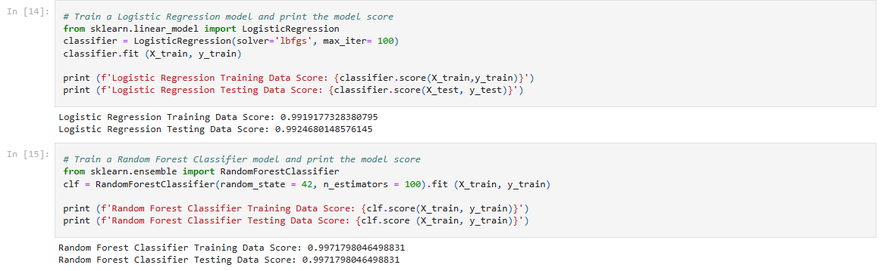

# Supervised Machine Learning - Predicting Credit Risk
In this project, a machine learning model is required to build to classify the risk level of given loans. Using the Logistic Regression model and Random Forest Classifier to compare which model is more suitable than the others.

### Background
Lending services companies allow individual investors to partially fund personal loans as well as buy and sell notes backing the loans on a secondary market..

### Retrieve the data
Utilizing to .csv files in the resource folder, the lending_data.csv contains the information of the loan size, interest rate, borrower income, debt to income, number of accounts, derogatory marks, total debt and loan status.

### Preprocessing: 
Using Pandas DataFrame to import the data, then using the train_test_split function to train and test the data

### Predict model performance
After looking at the dataset and considering the two model types, the Random Forests Classifier Regression would perform a better result because it would create many tree decision and pick out the best of each branch to fit in the data.

### Create and Fit a LogisticRegression model and RandomForestClassifier model to check against a prediction
Create a Logistic Regression model, fit it to the training data that was created in the previous step. Then, determine the model's score by using the score function and the testing data from the previous step. 
Do the same for a Random Forest Classifier.

Without scaling the data and based on the score values, both methods give a very high percentage 99.25% for Logistic Regression and 99.72% for Random Forest Classifier. However, the Random Forest Classifier's result was 0.47% higher than the Logistic Regression. As a result, it's a best method in this curcumstance data, defying my prediction.

#### References
Loan Approval Dataset (2022). Data for this dataset was generated by edX Boot Camps LLC, and is intended for educational purposes only.

